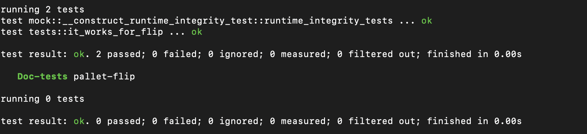

# Polkadot for contract Dapp Builders Workshop

## Quest 2

This workshop hasn't taught you about FRAME yet, but.. a hugely under appreciated aspect of ink! is how easy it is to turn a prototype written in ink! into it's own appchain. 🤯

Time permitting… let's follow the steps here and:

Create a repo with a basic FRAME pallet structure
Migrate the parts of your contract to a FRAME pallet
Make sure to join us later to dive deeper into building with the Polkadot SDK!

### My flipper ink! smart contract


```rust
#![cfg_attr(not(feature = "std"), no_std, no_main)]

#[ink::contract]
mod flipper {

    /// Defines the storage of your contract.
    /// Add new fields to the below struct in order
    /// to add new static storage fields to your contract.
    #[ink(storage)]
    pub struct Flipper {
        /// Stores a single `bool` value on the storage.
        value: bool,
    }

    #[ink(event)]
    pub struct Flipped {
        who: Option<AccountId>,
        value: bool
    }

    impl Flipper {

        #[ink(constructor)]
        pub fn new(init_value: bool) -> Self {
            Self { value: init_value }
        }

        #[ink(constructor)]
        pub fn default() -> Self {
            Self::new(Default::default())
        }

        /// A message that can be called on instantiated contracts.
        /// This one flips the value of the stored `bool` from `true`
        /// to `false` and vice versa.
        #[ink(message)]
        pub fn flip(&mut self) {
            self.value = !self.value;
            Self::env().emit_event(Flipped {
                who: Some(Self::env().caller()),
                value: self.value,
            });
        }

        /// Simply returns the current value of our `bool`.
        #[ink(message)]
        pub fn get(&self) -> bool {
            self.value
        }
    }
```


## Result 
### Migrate my own flipper contract into parachain runtime
1. Convert `Storage`

- ink! smart contract:

```rust
    #[ink(storage)]
    pub struct Flipper {
        /// Stores a single `bool` value on the storage.
        value: bool,
    }
```

- Pallet:

```rust
	#[pallet::storage]
	#[pallet::getter(fn flipper)]
	pub type Flipper<T> = StorageValue<_, bool, ValueQuery>;
```

2. Convert `Event`

- ink! smart contract:

```rust
    #[ink(event)]
    pub struct Flipped {
        who: Option<AccountId>,
        value: bool
    }
```

- Pallet:

```rust
	pub enum Event<T: Config> {
		Flipped { who: Option<T::AccountId>, value: bool },
	}
```

3. Convert `Constructor`

- ink! smart contract:

```rust
    #[ink(constructor)]
    pub fn new(init_value: bool) -> Self {
        Self { value: init_value }
    }

    #[ink(constructor)]
    pub fn default() -> Self {
        Self::new(Default::default())
    }
```

- Pallet:

```rust
	#[pallet::genesis_config]
	pub struct GenesisConfig<T> {
		pub value: bool,
		pub _phantom: PhantomData<T>
	}

	impl<T: Config> Default for GenesisConfig<T> {
		fn default() -> Self {
			Self { value: Default::default(), _phantom: PhantomData::default() }
		}
	}

	#[pallet::genesis_build]
	impl<T: Config> BuildGenesisConfig for GenesisConfig<T> {
		fn build(&self) {
			<Flipper<T>>::put(&self.value);
		}
	}
```

4. Convert `flip` transaction 

- ink! smart contract:

```rust
    #[ink(message)]
    pub fn flip(&mut self) {
        self.value = !self.value;
        Self::env().emit_event(Flipped {
            who: Some(Self::env().caller()),
            value: self.value,
        });
    }
```

- Pallet:

```rust
	#[pallet::call]
	impl<T: Config> Pallet<T> {
		
		#[pallet::call_index(0)]
		#[pallet::weight({10_000})]
		pub fn flip(origin: OriginFor<T>) -> DispatchResultWithPostInfo {

			let who = ensure_signed(origin)?;
			let current_value = <Flipper<T>>::get();

			<Flipper<T>>::put(!current_value);

			Self::deposit_event(Event::Flipped { who: Some(who), value: current_value });
			// Return a successful DispatchResultWithPostInfo
			Ok(().into())
		}
	}
```


### Run test case successfully

Test case:

```rust
#[test]
fn it_works_for_flip() {
	new_test_ext().execute_with(|| {
		System::set_block_number(1);

		assert_ok!(FlipModule::flip(RuntimeOrigin::signed(1)));
		assert_eq!(FlipModule::flipper(), true);
		System::assert_last_event(
			crate::Event::Flipped { who: Some(1), value: false }.into(),
		);
	});
}
```




## Link resource

+ https://hackmd.io/@webzero/contracts-workshop
+ https://github.com/JoinWebZero/contracts-workshop
